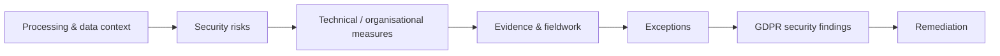

# UK GDPR Security Control Assessment Demo

> **Portfolio Case Study — All organisations, people, systems, evidence, findings and management responses referenced here are fictional or synthetic. This repository demonstrates security / control-assurance methodology supporting UK GDPR compliance and does not represent a real client audit, certification audit, legal opinion or regulatory assurance engagement.**

A security and technical/organisational control assessment for the fictional UK bank **Meridian Trust Bank plc (`MT-ENT-002`)**, centred on UK GDPR Article 32 security-of-processing considerations.

**Release:** `uk-gdpr-control-assessment-demo v1.0.0`

## Project objective

Assess whether selected security and governance measures are designed and operating in a manner appropriate to the risks in the fictional processing environment.



## Assessment scope

### Article 32 security assurance

Selected technical and organisational areas include:

- identity and access management
- encryption / data protection controls
- vulnerability management
- logging and monitoring
- resilience and recovery
- security testing
- processor security controls

### Supporting governance exercises

The project also includes:

- selected processing / ROPA context
- breach-notification readiness exercise
- data-subject-rights process review
- processor security review
- restricted-transfer spot check using UK-relevant mechanisms and concepts

These exercises support the assessment context; they are not presented as a complete legal-compliance determination.

## Final release position

| Measure | Result |
|---|---:|
| Final GDPR findings | **5** |
| In remediation | **3** |
| Open | **2** |

- every final finding maps to a canonical underlying MTFS issue
- evidence, test/workpaper, exception and remediation joins were validated
- no `MT-RET-*` or closure-evidence IDs were released in `v1.0.0`
- no finding is represented as closed without retest evidence

## Assessment flow

```text
processing activity / data
        ↓
risk
        ↓
expected security measure
        ↓
evidence
        ↓
test / workpaper
        ↓
exception
        ↓
canonical issue
        ↓
GDPR finding
        ↓
remediation
```

## Repository structure

| Path | Purpose |
|---|---|
| `01-engagement/` | scope, legal boundary and assessment planning |
| `02-assessment/` | processing context and Article 32-focused assessment |
| `03-evidence/` | evidence request, log, manifest and synthetic artifacts |
| `04-fieldwork/` | walkthroughs, testing and supporting process reviews |
| `05-findings/` | UK GDPR security findings |
| `06-remediation/` | management actions, owners, dates and status |
| `07-reporting/` | executive and technical reporting |
| `08-analytics/` | control coverage, severity and remediation analysis |

## Cross-framework linkage

Technical conditions already identified elsewhere in the portfolio reuse the same canonical MTFS underlying issue ID where the condition is genuinely the same.

This allows a single control weakness to be viewed through different assessment lenses without duplicating the underlying issue.

## Related portfolio projects

- `grc-portfolio-hub`
- `iso27001-audit-demo`
- `compliance-evidence-automation`
- `operational-resilience-ict-risk-demo`
- `nist-csf-maturity-demo`

## Assurance boundary

This repository demonstrates **security/control assurance supporting UK GDPR compliance**. It is not legal advice, a legal compliance opinion or regulator-issued assurance.
