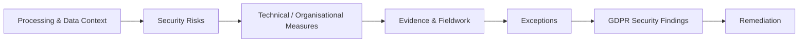

# UK GDPR Security Control Assessment

> **Synthetic project environment.** Meridian Trust Financial Services (MTFS), its people, systems, evidence, findings and management responses are fictional or synthetic. This repository demonstrates security assurance / audit methodology and does not represent a real client engagement, certification audit, legal opinion or regulatory assurance.

A security and technical/organisational control-assurance project for the fictional UK bank **Meridian Trust Bank plc (`MT-ENT-002`)**, centred on UK GDPR Article 32 security-of-processing considerations.

**Release:** `v1.0.0`

## Objective

Assess whether selected security and governance measures are designed and operating appropriately for the risks in the synthetic processing environment.



## Assessment scope

### Article 32 security assurance

Selected areas include:

- identity and access management
- encryption / data-protection controls
- vulnerability management
- logging and monitoring
- resilience and recovery
- security testing
- processor security controls

### Supporting governance exercises

- selected processing / ROPA context
- breach-notification readiness
- data-subject-rights process review
- processor security review
- restricted-transfer spot check using UK-relevant mechanisms and concepts

These support the assessment context; they are not presented as a complete legal-compliance determination.

## Final release position

| Measure | Result |
|---|---:|
| Final GDPR findings | **5** |
| In remediation | **3** |
| Open | **2** |

- every final finding maps to a canonical MTFS issue
- evidence, test/workpaper, exception and remediation joins are preserved
- no `MT-RET-*` or closure-evidence IDs were released in `v1.0.0`
- no finding is represented as closed without retest evidence

## Assessment chain

```text
processing activity / data
        ↓
risk
        ↓
expected security measure
        ↓
evidence
        ↓
test / workpaper
        ↓
exception
        ↓
canonical issue
        ↓
GDPR finding
        ↓
remediation
```

## Repository structure

| Path | Purpose |
|---|---|
| `01-engagement/` | scope, legal boundary and planning |
| `02-assessment/` | processing context and Article 32-focused assessment |
| `03-evidence/` | evidence request, log, manifest and synthetic artifacts |
| `04-fieldwork/` | walkthroughs, testing and supporting process reviews |
| `05-findings/` | UK GDPR security findings |
| `06-remediation/` | management actions, owners, dates and status |
| `07-reporting/` | executive and technical reporting |
| `08-analytics/` | coverage, severity and remediation analysis |

## Related projects

- **[Security Assurance Lab](https://github.com/adityavm19/security-assurance-lab)**
- **[ISO 27001 Audit](https://github.com/adityavm19/iso27001-audit-demo)**
- **[Compliance Evidence Automation](https://github.com/adityavm19/compliance-evidence-automation)**
- **[Operational Resilience & ICT Risk](https://github.com/adityavm19/operational-resilience-ict-risk-demo)**
- **[NIST CSF 2.0 Assessment](https://github.com/adityavm19/nist-csf-maturity-demo)**

## Assurance boundary

This project demonstrates **security/control assurance supporting UK GDPR compliance**. It is not legal advice, a legal compliance opinion or regulator-issued assurance.
